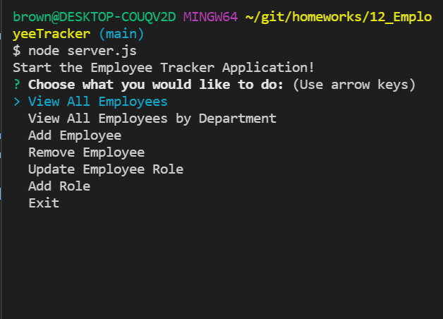
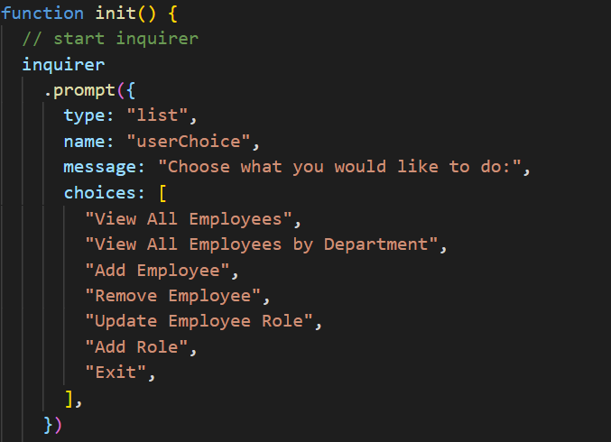
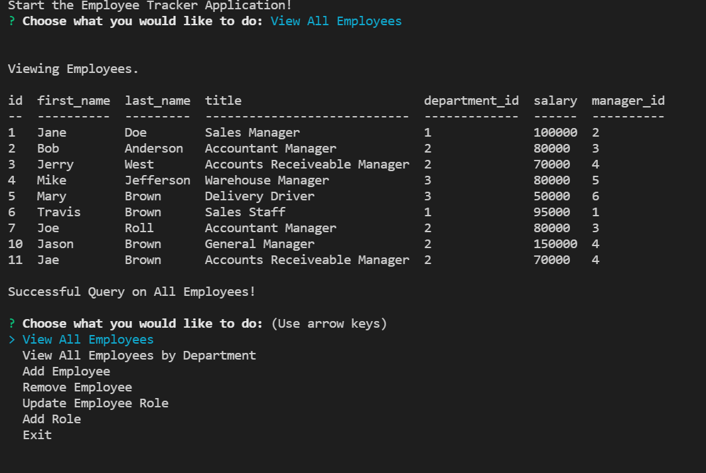

# 12_EmployeeTracker

## Your Task

Developers are often tasked with creating interfaces that make it easy for non-developers to view and interact with information stored in databases. Often these interfaces are known as **C**ontent **M**anagement **S**ystems. In this homework assignment, your challenge is to architect and build a solution for managing a company's employees using node, inquirer, and MySQL.

## User Story

```
As a business owner
I want to be able to view and manage the departments, roles, and employees in my company
So that I can organize and plan my business
```

## Starting Schema Database

Design the following database schema containing three tables:


- **department**:

  - **id** - INT PRIMARY KEY
  - **name** - VARCHAR(30) to hold department name

- **role**:

  - **id** - INT PRIMARY KEY
  - **title** - VARCHAR(30) to hold role title
  - **salary** - DECIMAL to hold role salary
  - **department_id** - INT to hold reference to department role belongs to

- **employee**:

  - **id** - INT PRIMARY KEY
  - **first_name** - VARCHAR(30) to hold employee first name
  - **last_name** - VARCHAR(30) to hold employee last name
  - **role_id** - INT to hold reference to role employee has
  - **manager_id** - INT to hold reference to another employee that manages the employee being Created. This field may be null if the employee has no manager

## Table of Contents

If your README is long, add a table of contents to make it easy for users to find what they need.

- [Links to Application](#Links)
- [Mock-Up](#Mock-Up)
- [Install](#installation)
- [Usage](#usage)
- [Credits](#credits)
- [Test](#test)
- [Questions](#questions)

## Links

Below are links to access the deployed video link and repository.

Github Repository: https://github.com/bergannation/12_EmployeeTracker

Deployed Video Link: https://drive.google.com/file/d/1Ku78B2f7yVrxJm0RC9dff0V0_Ta0FOc1/view

## Mock-Up

The following gif shows the web application's appearance and functionality:


## Installation

The user will be required to use the Inquirer/MySQL/Console.Table package via NodeJS & NPM commands. The user will input the following in their command line to install the neccessary packages:

```bash
npm i inquirer
npm i mysql
npm i console.table
```

## Usage

The user will begin the process by invoking the application in NodeJS. The application will be invoked by using the following command:

```bash
node server.js
```



Below is the starting code that initiates the inquirer:



Once the user has initiated the program via node, the user will be presented with a series of questions/prompts. The user will navigate via arrow keys to select their option. The image below displays an example of what will present itself when an option is selected.



## Tests

Testing: no testing is required

## Questions

Here is a link to my github for more information: [Github]: https://github.com/BerganNation

You can reach me with any additional questions by email: BerganNation@gmail.com
